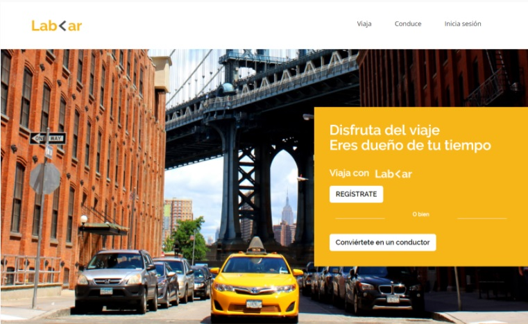
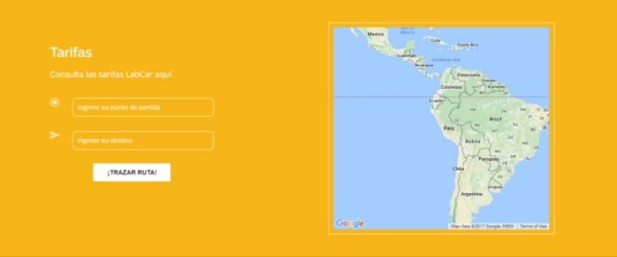
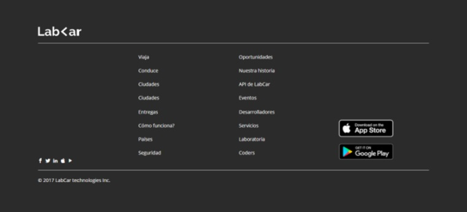
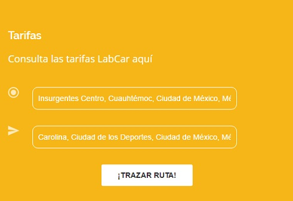
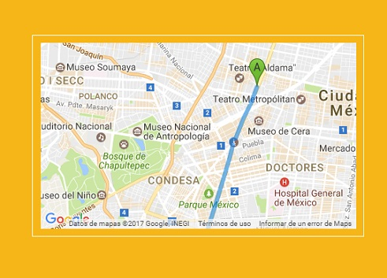
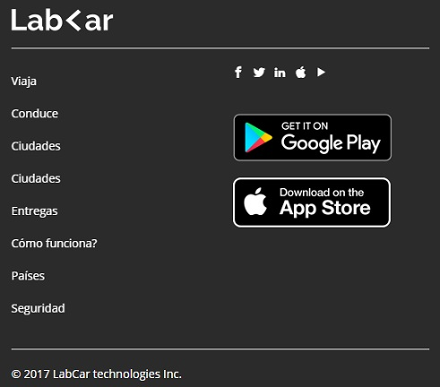

## LAB-<AR
Recrea la siguiente página web. Las imágenes y todo lo que necesitas lo encuentras aquí, recuerda hacer un fork del repositorio y clonarlo en tu máquina.

1. LA VERSIÓN WEB

2. LA VERSIÓN MOVIL

Y obviamente no podemos dejar de lado la versión móvil, así que créala como segunda parte.

